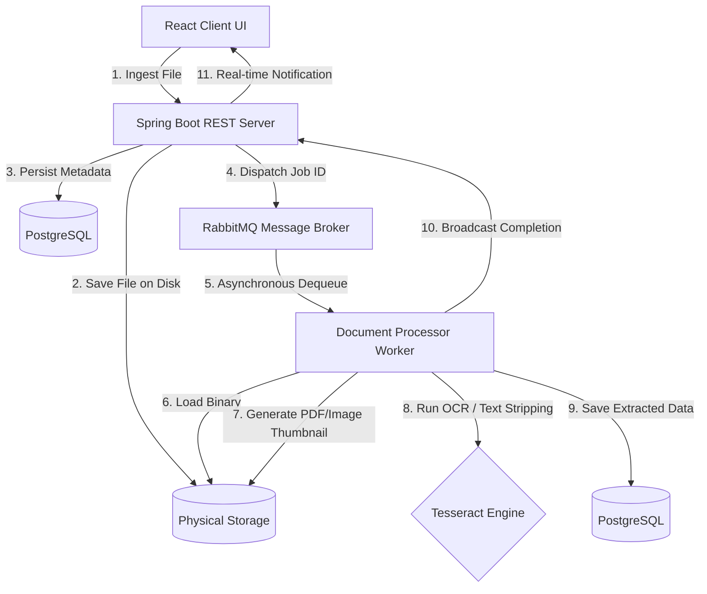

# 📂 Intelligent Document Processing Platform

An enterprise-ready, production-grade full-stack SaaS application for asynchronous document ingestion, full-text intelligent search, optical character recognition (OCR), and visual metadata analysis. 

Built using a high-performance **Spring Boot** backend architecture alongside a modern, premium **React (Vite)** dashboard client, utilizing **RabbitMQ** for event-driven message queuing, **Redis** for state caching, and **PostgreSQL** for relational metadata.

---

## 📋 Table of Contents
1. [✨ Platform Capabilities](#-platform-capabilities)
2. [🛠️ Tech Stack](#️-tech-stack)
3. [🏗️ High-Level System Architecture](#️-high-level-system-architecture)
4. [📂 Repository Directory Structure](#-repository-directory-structure)
5. [🚀 Quickstart Guide](#-quickstart-guide)
6. [🧠 Intelligent OCR Fallback System](#-intelligent-ocr-fallback-system)
7. [📸 Event-Driven Thumbnail Rendering](#-event-driven-thumbnail-rendering)
8. [🗑️ Safe Cascade Deletion Pipeline](#️-safe-cascade-deletion-pipeline)
9. [📡 Core API Directory](#-core-api-directory)
10. [👤 Author & Acknowledgments](#-author--acknowledgments)

---

## ✨ Platform Capabilities

*   **⚡ Decoupled Event-Driven Ingestion**: File uploads complete instantly. Heavy extraction tasks are immediately queued to asynchronous worker nodes via RabbitMQ to keep the REST thread pool lightweight and highly scalable.
*   **📸 Dynamic Thumbnail Pipeline**: Extracts and renders the first page of uploaded PDFs (`PDFBox`) and resizes image uploads (`Thumbnailator`) in the background, serving them to the client statelessly and securely.
*   **🧠 Intelligent OCR Engine (`Tess4J`)**: A multi-stage text parser that reads plain text directly, extracts structured layers from PDFs, and automatically falls back to native **Tesseract OCR** for scanned photocopies or raw images (`PNG`, `JPG`).
*   **🔍 Full-Text Keywords Search Console**: Runs native indexes and matching preview snippet generators over extracted database fields for real-time document search.
*   **🎨 Premium Glassmorphic Dashboard**: Designed using tech-standard typography (**Outfit** & **Inter**) and modern Tailwind variables. Features real-time background queue sync indicators, interactive dashed upload zones, and graphical result matching tags.
*   **🗑️ Programmatic Cascade Deletion**: Deletes documents safely by programmatically cleaning up dependent extraction records, queue jobs, and purging local physical files and visual thumbnails from the disk storage.
*   **🔑 Secure Auth Policies**: Custom JWT filtering that bypasses static uploads `/uploads/**` to minimize overhead while keeping management APIs fully secure.

---

## 🛠️ Tech Stack

### ☕ Backend Services
*   **Core Framework**: Spring Boot 4.x, Java 21, Spring Security + JWT
*   **Asynchronous Messaging**: RabbitMQ (AMQP)
*   **Cache & Session State**: Redis
*   **Relational Database**: PostgreSQL (Production), H2 (In-memory testing)
*   **File Analysis**: Apache PDFBox, Apache Tika, Thumbnailator
*   **Character Recognition**: Tess4J (Tesseract JNI JNA Wrapper)
*   **Testing Suites**: JUnit 5, AssertJ, Mockito, Testcontainers (Postgres, RabbitMQ)

### 🎨 Frontend Dashboard
*   **Core Library**: React (Vite environment)
*   **Styling Engine**: Tailwind CSS
*   **Navigation & State**: React Router DOM (Dynamic nav links), React AuthContext

---

## 🏗️ High-Level System Architecture



---

## 📂 Repository Directory Structure

```text
document-processing-system/
├── src/main/java/com/docprocessor/system/
│   ├── config/             # Spring Security, JNA Web Mappings, WebSocket STOMP
│   ├── controller/         # REST APIs (Auth, Documents, Jobs, Admin consoles)
│   ├── dto/                # Data Transfer Objects (AuthResponse, SearchResult)
│   ├── messaging/          # RabbitMQ Listener, PDF/Image Thumbnail, Tesseract OCR
│   ├── model/              # JPA Database Entities (User, Document, Job, Results)
│   ├── repository/         # JPA Repository layers
│   └── service/            # Business layer (Stateless Search, Cascade Deletion)
├── frontend/
│   ├── public/             # Static graphics assets
│   ├── src/
│   │   ├── components/     # Reusable widgets (Sticky Glassmorphic Navbar)
│   │   ├── context/        # Global Auth providers
│   │   ├── pages/          # SaaS views (Dashboard, Documents, Search, Auth)
│   │   └── services/       # Frontend api clients
│   ├── vite.config.js      # Forwarding proxy redirects for /uploads static assets
│   └── tailwind.config.js  # Premium design styling rules
├── uploads/                # EXCLUDED - Local physical storage path
├── logs/                   # EXCLUDED - Runtime application logs
├── pom.xml                 # Maven dependency manifests (Added Tess4J)
└── docker-compose.yml      # Service configurations (Postgres, Redis, RabbitMQ)
```

---

## 🚀 Quickstart Guide

### Prerequisites
*   **Java 21 (JDK)**
*   **Node.js** (LTS version)
*   **Docker & Docker Compose**
*   **Tesseract OCR** (For active character extraction on raw images or scanned PDFs)

---

### Step 1: Start Infrastructure Containers
Launch the required database, cache, and message queue services:
```bash
docker-compose up -d
```
*This starts PostgreSQL on port `5432`, Redis on `6379`, and RabbitMQ on `5672` (Management portal on `15672`).*

---

### Step 2: Configure and Start the Spring Boot Backend
1. Open the project inside your IDE (IntelliJ IDEA / VS Code).
2. Start the Spring Boot server using Maven:
```powershell
./mvnw.cmd spring-boot:run
```
*The API server launches on port `8080`.*

---

### Step 3: Install Frontend Dependencies & Start React
Navigate to the frontend folder and activate the development server:
```bash
cd frontend
npm install
npm run dev
```
*The React client launches on port `3000` (auto-forwarding requests to port `8080` backend).*

---

## 🧠 Intelligent OCR Fallback System

Scanned media (such as phone pictures or scanned PDF documents) do not contain standard digital selectable text layers. The processor utilizes a resilient fallback structure:

1. **Text Stripping**: The worker uses `PDFTextStripper` to try and extract embedded digital text.
2. **Scanned Trigger**: If the text returns empty, the pipeline instantly diverts the binary to **Tess4J** (the JNA native wrapper for the C++ **Tesseract OCR** engine).
3. **Execution Safety**: If Tesseract is not installed on the system, the worker **logs the warning and records a placeholder message** in the search index, ensuring the background thread **never crashes**.

### Installing Tesseract locally:
*   **Windows**: Download and run the [UB Mannheim installer](https://github.com/UB-Mannheim/tesseract/wiki), and add `C:\Program Files\Tesseract-OCR` to your System Environment variables.
*   **Linux**: `sudo apt-get install tesseract-ocr tesseract-ocr-eng`
*   **macOS**: `brew install tesseract`

---

## 📸 Event-Driven Thumbnail Rendering

Visual previews are generated background-threads dynamically:
1. **PDFs**: Using `PDFBox` PDFRenderer, the worker renders the first page image at `150 DPI`.
2. **Images**: Instantly loads the raw image payload.
3. **Resizing**: Thumbnailator resizes the visual frames to a standardized `200x200 px` bounding rectangle.
4. **Stateless Serving**: Files are written under the local `./uploads/` directory, proxied statelessly by Spring MVC mappings `/uploads/**`, allowing instant UI loads.

---

## 🗑️ Safe Cascade Deletion Pipeline

To prevent database constraint violations, the `DocumentService.java` performs a safe programmatic cascade deletion:
```java
// 1. Cleans up background worker jobs in the queue
jobRepository.deleteByDocumentId(id);

// 2. Drops full-text matching results
processingResultRepository.deleteByDocumentId(id);

// 3. Purges metadata references in PostgreSQL
documentRepository.deleteById(id);

// 4. Physical cleanup: Erases the document file and generated thumbnail from disk
Files.deleteIfExists(Path.of(doc.getStoragePath()));
Files.deleteIfExists(Path.of(doc.getStoragePath() + "_thumb.png"));
```

---

## 📡 Core API Directory

| Endpoint | Method | Security | Purpose |
| :--- | :---: | :---: | :--- |
| `/api/auth/register` | `POST` | Public | Registers a new user |
| `/api/auth/login` | `POST` | Public | Validates credentials and yields JWT |
| `/api/documents/upload`| `POST` | User | Accepts files and dispatches RabbitMQ jobs |
| `/api/documents` | `GET` | User | Fetches user's processed catalog |
| `/api/documents/{id}` | `DELETE`| User | Deletes documents, metadata, and files |
| `/api/search` | `GET` | User | Runs keyword indexing queries |
| `/uploads/{name}` | `GET` | Public | Bypasses filters to serve thumbnails statelessly |

---

## 👤 Author & Acknowledgments

*   **Author**: Gaurang (`gaurangkgd`)
*   **Email**: `gauranggd1608@gmail.com`
*   **Acknowledgments**: Built with Spring Boot, RabbitMQ, Redis, Tesseract OCR, Tailwind CSS, and net.coobird.thumbnailator.

---
*Developed as a highly resilient, enterprise-ready asynchronous processing SaaS architecture.*
